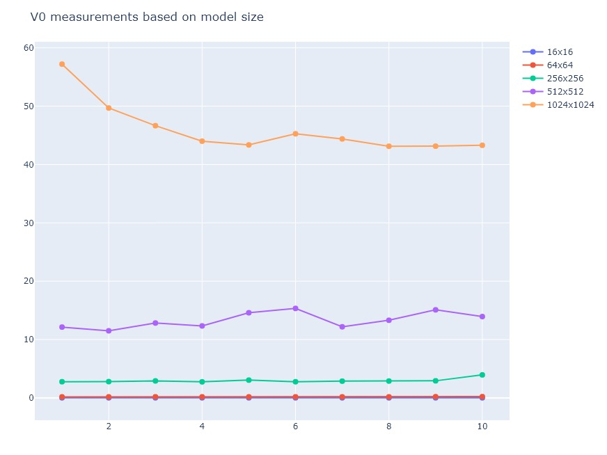
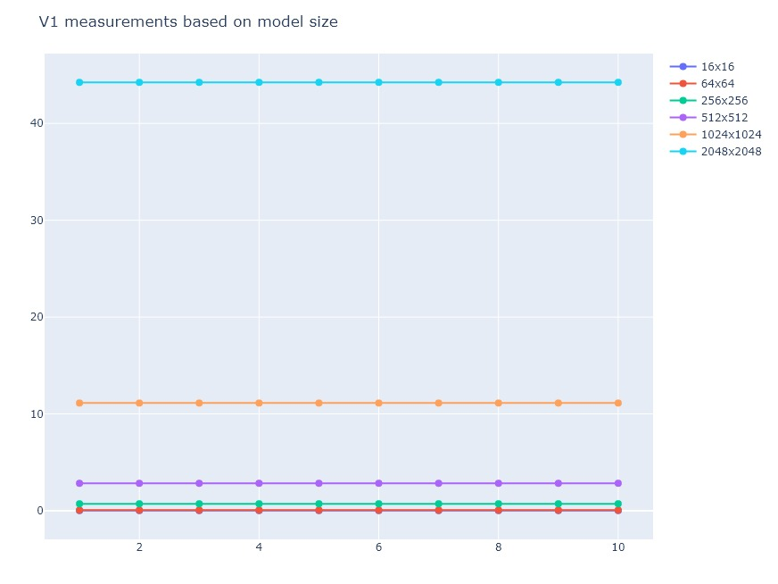

# Parallel-Distributed-Systems-part3

The goal of this assignment is to implement the Ising model using **CUDA**. The implementation was completed in 4 phases, to be analysed below.
\
\
The Ising model is a mathematical model of ferromagnetism in statistical mechanics. The model consists of discrete magnetic dipole moments of atomic “spins” that can be in one of two states (+1 or −1). The spins are arranged in a square 2D lattice with periodic boundary conditions, allowing each spin to interact with its four immediate neighbors. The dipole moments update in discrete time steps according to the majority of the spins among the four neighbors of each lattice point. The edge lattice points wrap around to the other side (known as toroidal or periodic boundary conditions), i.e. if side length is `n`, and grid coordinates are `0:n−1`, then the previous to node `0` is node `n−1` and vice versa. More on the Ising model [on Wikipedia.](https://en.wikipedia.org/wiki/Ising_model)
\
\
The calculation this assignment is based upon is:
\

\
for two coordinates `i,j` of the model `G`.

## V0 - Sequential
This version handles an `NxN` model and simulates it for `k` iterations. Both of these parameters are given by the user. It was implemented in *plain C*. The model was depicted by *2D array*, presented as an `int**`. Instead of using *if statements*, the `get_model` function was used in order to make the structure toroidal, as required:
```c
int get_model(int **model, int i, int j, int n) {
  return model[(i + n) % n][(j + n) % n];
}
```
The `+n` part takes care of negative indices and the `%n` part makes sure that the program doesn't steer out of bounds. This function, or similar implementations of it, were used throughout every phase of this assignment.
\
Another noteworthy factor, that was useful for every part of the realization of the project is the discrimination of the `before` and `after` models. Before each iteration, the `after` values are given to the `before` model, and every change is written back on the `after` model. This way, we can make sure the program will also work in parallel for the next versions, as well.
\
\
Below are the tests conducted for sizes *16, 64, 256, 512, 1024* for **1000 iterations**. Times are measured in seconds.
)


## V1 - GPU with one thread per moment
For this stage of the project, the model is copied to the GPU and each moment (i.e. node on the array) is handled by a thread. This is made easier by turning the model to a **1D array**. For starters, each thread is placed inside its own block:
```c
simulate_model<<<size, 1>>>(d_before, d_after, N);
```
)
\
We can blame the lack of fluctuations to the fact that all the GPU tests were conducted on the **HPC platform** and not locally. This means that no other process had the right to interrupt the GPU, contrary to what happens when tests are realized locally.