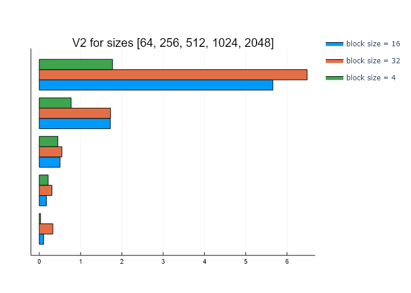
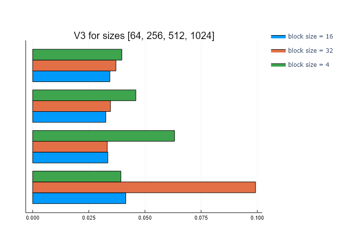

# Parallel-Distributed-Systems-part3

### Authored by Antonios Antoniou
### Aristotle University Thessaloniki
### Electrical and Computer Engineering

## The goal of the assignment
The goal of this assignment is to implement the Ising model using **CUDA**. The implementation was completed in 4 phases, to be analysed below.
\
\
The Ising model is a mathematical model of ferromagnetism in statistical mechanics. The model consists of discrete magnetic dipole moments of atomic “spins” that can be in one of two states (+1 or −1). The spins are arranged in a square 2D lattice with periodic boundary conditions, allowing each spin to interact with its four immediate neighbors. The dipole moments update in discrete time steps according to the majority of the spins among the four neighbors of each lattice point. The edge lattice points wrap around to the other side (known as toroidal or periodic boundary conditions), i.e. if side length is `n`, and grid coordinates are `0:n−1`, then the previous to node `0` is node `n−1` and vice versa. More on the Ising model [on Wikipedia.](https://en.wikipedia.org/wiki/Ising_model)
\
\
The calculation this assignment is based upon is:
\

\
for two coordinates `i,j` of the model `G`.

## V0 - Sequential
This version handles an `NxN` model and simulates it for `k` iterations, both of which are given by the user. It was implemented in *plain C*. The model was depicted by a *2D array*, presented as an `int**`. Instead of using *if statements*, the `get_model` function was used in order to make the structure toroidal, as required:
```c
int get_model(int **model, int i, int j, int n) {
  return model[(i + n) % n][(j + n) % n];
}
```
The `+n` part takes care of negative indices and the `%n` part makes sure that the program doesn't steer out of bounds. This function, or similar implementations of it, were used throughout every phase of this assignment.
\
Another noteworthy factor, that was useful for every part of the realization of the project is the discrimination of the `before` and `after` models. Before each iteration, the `after` values are given to the `before` model, and every change is written back on the `after` model. This way, we can make sure the program will also work in parallel for the next versions, as well.
\
\
Below are the tests conducted for sizes **16, 64, 256, 512, 1024** for **1000 iterations**. Times are measured in seconds.


## V1 - GPU with one thread per moment
For this stage of the project, the model is copied to the GPU and each moment (i.e. node on the array) is handled by a thread. This is made easier by turning the model to a **1D array**. For starters, each thread is placed inside its own block:
```c
simulate_model<<<size, 1>>>(d_before, d_after, N);
```

\
We can blame the lack of fluctuations to the fact that all the GPU tests were conducted on the **HPC platform** and not locally. This means that no other process had the right to interrupt the GPU, contrary to what happens when tests are realized locally.
\
\
It is very clear that the time performance is drastically better than the one of the sequential implementation. Indicatively, the execution time of a model of size `2048x2048` for V1 is almost identical to the time it took V0 to process a `1024x1024` model.

## V2 - GPU with one thread computing a block of moments
Based on the V1 implementation, the V2 model calculates the sign function for a batch of blocks, typically a `BxB` square on the 2D model. The only change that needed to be done to the code was the organization of the GPU threads
```c
simulate_model<<<N * N / (B * B), 1>>>(d_before, d_after, N, B);
```
The `NxN` model is divided into `BxB` blocks and the rest of the procedure is identical to the cases above.
\
Below are the measurements for sizes **64, 256, 512, 1024, 2048** and block sizes **4, 16, 32**.

\
Once again, the discrepancies between two consecutive versions are increasing with the increase of size. One observation that is extremely useful is here, is how `block size = 4` probably offers the optimal balance between the workload of an individual thread and the overhead frequent main memory accesses result in. Increasing the block size, to an extent, helps with minimizing the time spent in making data to threads directly accessible.

## V3 - GPU with multiple thread sharing common input moments
The V3 and V2 models are identical in the way they work and process data. The fundamental, and only, difference between the two is that V3 utilizes the speed of the shared memory among threads of the same block. My implementation, which was kind of strict in how the data is organized and accessed, only allowed me to see how the model works only for sizes that could fit the whole structure in a block. Hence, every test below has been done for the same parameters as V2, with `1 GPU block`. Note that the max size tested was 1024, since, according to the majority of the available information this is the maximum capacity for every GPU.

\
Here, `block size = 16` seems to behave better than the previous model. However, the time differences are now minimal from head to toe. This is a clear indication that the vast majority of the execution time on the given task is spent on copying or accessing data between memories.